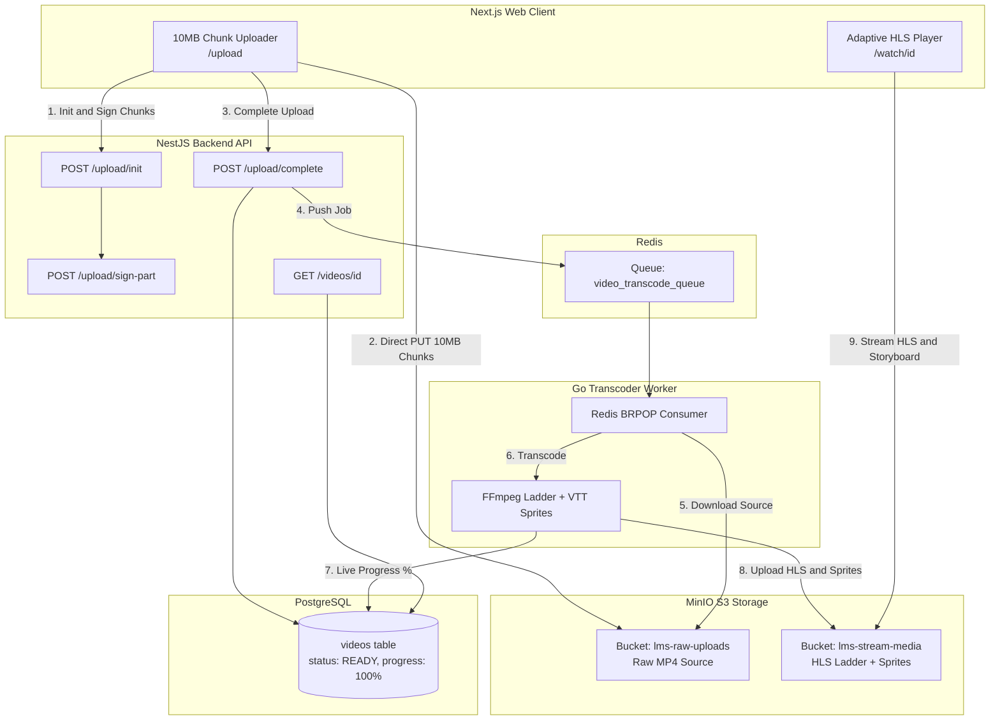

# 🚀 High-Performance LMS Video Streaming Platform (PoC)

An enterprise-grade, distributed video processing and adaptive streaming architecture built for modern Learning Management Systems (LMS).

Featuring **Direct-to-S3 Chunked Multipart Uploads**, an asynchronous **Go + FFmpeg Transcoding Worker Fleet**, and a custom **Next.js 16 Adaptive HLS Player** with **Interactive Storyboard Hover Thumbnail Scrubbing** (YouTube/Udemy style).

---

## 🌟 Key Architecture & Features

- ⚡ **Direct-to-S3 Chunked Uploads**: Videos are sliced into 10MB chunks in the browser using `file.slice()` and uploaded directly to MinIO/S3 via presigned part URLs. **Zero server RAM or network buffering on the API**.
- 🎬 **Asynchronous Go Transcoder Fleet**: High-performance Go worker consumes jobs from Redis (`video_transcode_queue`) and executes FFmpeg multi-bitrate ladders.
- 📐 **Adaptive Bitrate Streaming (HLS)**: Generates `360p` (800k), `720p` (2800k), `1080p` (5000k) renditions and a master playlist (`master.m3u8`).
- 🖼️ **Storyboard Hover Scrubbing**: Automatically creates a tiled sprite sheet (`sprite.jpg`) and parses WebVTT cues (`storyboard.vtt`) for live seekbar thumbnail previews on timeline hover.
- 📊 **Real-Time Progress Tracking**: Parses FFmpeg `out_time_us` progress in real time, updating PostgreSQL (`0% -> 100%`) for live UI status polling.
- 📺 **Custom Adaptive Video Player**: Built with `hls.js`, quality switcher (Auto, 1080p, 720p, 360p), playback speed selector (0.5x–2x), and keyboard shortcuts (`Space`, `F`, `M`, `J`/`L`, Arrows).
- 🧼 **Clean Monorepo & Scoped Environment**: Turborepo + pnpm with isolated, package-level `.env` configurations to prevent credential leakage to frontend bundles.

---

## 🏛️ System Architecture Flow



---

## 📁 Repository Structure

```
lms-video-poc/
├── apps/
│   ├── api/                  # NestJS 11 Backend API
│   │   ├── src/
│   │   │   ├── upload/       # Multipart S3 upload init, signing & completion
│   │   │   ├── video/        # Video metadata & status query endpoints
│   │   │   ├── s3/           # AWS SDK S3 client & presigning
│   │   │   ├── redis/        # Redis job producer
│   │   │   └── database/     # Prisma service
│   │   ├── .env.example
│   │   └── .env
│   │
│   ├── web/                  # Next.js 16 (App Router) Frontend
│   │   ├── app/
│   │   │   ├── upload/       # Drag-and-drop chunked uploader
│   │   │   ├── watch/[id]/   # Video player watch page
│   │   │   └── page.tsx      # Video course library dashboard
│   │   ├── components/       # Custom HLS Player & Navigation
│   │   ├── lib/              # S3 chunked uploader & WebVTT parser
│   │   ├── .env.example
│   │   └── .env.local
│   │
│   └── transcoder/           # Go 1.26 + FFmpeg Worker Fleet
│       ├── cmd/worker/       # Worker entrypoint & graceful shutdown
│       ├── internal/
│       │   ├── ffmpeg/       # HLS ladder & storyboard sprite generator
│       │   ├── worker/       # Redis BRPOP consumer & job lifecycle
│       │   ├── s3/           # MinIO download & stream directory uploader
│       │   └── db/           # PostgreSQL connection pool (pgx)
│       ├── .env.example
│       └── .env
│
├── packages/
│   ├── database/             # Prisma 6 schema & PostgreSQL client
│   └── ts-config/            # Shared TypeScript configuration
│
├── docker-compose.yml        # PostgreSQL, Redis, MinIO & auto-provisioning
├── pnpm-workspace.yaml       # pnpm workspace definition
└── turbo.json                # Turborepo task pipeline
```

---

## 🛠️ Prerequisites

Make sure you have the following installed on your machine:
- **Node.js**: `>= 20.x`
- **pnpm**: `>= 9.x`
- **Go**: `>= 1.22.x`
- **Docker & Docker Compose**
- **FFmpeg & FFprobe (Installed on Host)**:
  - **macOS** (Homebrew):
    ```bash
    brew install ffmpeg
    ```
  - **Ubuntu / Debian**:
    ```bash
    sudo apt update && sudo apt install -y ffmpeg
    ```
  - **Windows** (winget / Chocolatey):
    ```bash
    winget install Gyan.FFmpeg
    ```
  - **Verify Installation**:
    ```bash
    ffmpeg -version
    ffprobe -version
    ```

---

## 🚀 Quickstart Guide

### 1. Clone & Install Dependencies

```bash
git clone https://github.com/your-username/lms-video-poc.git
cd lms-video-poc
pnpm install
```

### 2. Start Infrastructure (PostgreSQL, Redis, MinIO S3)

```bash
docker compose up -d
```
> The `minio-provision` container will automatically create and configure public read access for the buckets `lms-raw-uploads` and `lms-stream-media`.

### 3. Initialize Environment Files

Copy the provided template `.env.example` files to their active configurations:

```bash
# Frontend
cp apps/web/.env.example apps/web/.env.local

# Backend API
cp apps/api/.env.example apps/api/.env

# Database
cp packages/database/.env.example packages/database/.env

# Go Transcoder
cp apps/transcoder/.env.example apps/transcoder/.env
```

### 4. Run Database Migrations & Generate Prisma Client

```bash
pnpm db:migrate
pnpm db:generate
```

### 5. Start Web & API Development Servers

```bash
pnpm dev
```
- **Next.js Web Frontend**: [http://localhost:3000](http://localhost:3000)
- **NestJS Backend API**: [http://localhost:4000/api](http://localhost:4000/api)
- **MinIO Console**: [http://localhost:9001](http://localhost:9001) (`minioadmin` / `minioadmin`)

### 6. Start the Go Transcoder Worker

In a separate terminal tab:

```bash
cd apps/transcoder
go run cmd/worker/main.go
```

---

## 🎬 Testing the Pipeline

1. Open **[http://localhost:3000/upload](http://localhost:3000/upload)**.
2. Select or drag-and-drop a large video file (`.mp4`, `.mov`, `.mkv`).
3. Watch the 10MB chunk progress bar upload directly to MinIO without server overhead.
4. Watch the Go worker terminal automatically transcode the video into 360p, 720p, and 1080p HLS playlists + storyboard sprites.
5. Click **Watch Video** on the dashboard to test:
   - **Adaptive Quality Switching** (Auto, 1080p, 720p, 360p)
   - **Timeline Hover Thumbnail Scrubbing**
   - **Keyboard Shortcuts** (`Space` for Play/Pause, `F` for Fullscreen, `J`/`L` for 10s Skip)

---

## 📄 License

MIT License. Feel free to use and adapt this architecture for your projects!
