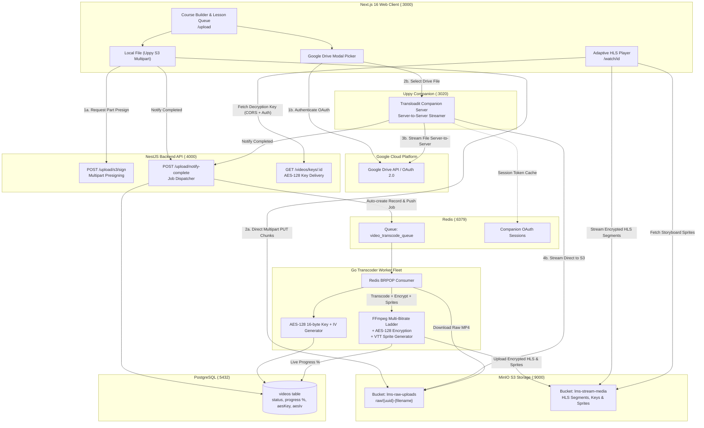

# 🚀 High-Performance LMS Video Streaming Platform (PoC)

An enterprise-grade, distributed video processing and adaptive streaming architecture built for modern Learning Management Systems (LMS).

Featuring **Direct-to-S3 Chunked Multipart Uploads**, **Server-to-Server Google Drive Video Imports (Uppy Companion)**, **AES-128 Segment Encryption**, **Anti-Piracy Dynamic Watermarking**, an asynchronous **Go + FFmpeg Transcoding Worker Fleet**, and a custom **Next.js 16 Adaptive HLS Player** with **Interactive Storyboard Hover Thumbnail Scrubbing** (YouTube/Udemy style).

---

## 🌟 Key Architecture & Features

- ⚡ **Direct-to-S3 Chunked Uploads**: Powered by `@uppy/core` and `@uppy/aws-s3`. Videos are sliced into chunks in the browser and uploaded directly to MinIO/S3 via presigned multipart URLs. **Zero server RAM or network buffering on the API**.
- ☁️ **Remote Google Drive Import (Uppy Companion)**: Instructors can connect their Google Drive and select videos directly from the cloud. Companion handles **server-to-server streaming** directly into MinIO S3 without consuming user device bandwidth or local memory.
- 🎓 **Multi-Lesson Course Builder**: Intuitive batch lesson queue (`QueueVideoUploader`) allowing instructors to add lessons, name titles, choose between **Local File** or **Google Drive**, and monitor real-time upload speed, ETA, and progress.
- 🔐 **HLS AES-128 Segment Encryption**: FFmpeg encrypts all `.ts` video segments with AES-128 using dynamically generated 16-byte keys. Segments stored in S3 cannot be played without passing through the authenticated NestJS key delivery endpoint (`GET /videos/keys/:id`).
- 🛡️ **Anti-Piracy Dynamic Watermarking**: Custom player dynamically shifts a subtle viewer identity overlay (e.g. `student@lms-demo.com | ID: #84920`) across random canvas coordinates to deter screen recording and copyright leaks.
- 🎬 **Asynchronous Go Transcoder Fleet**: High-performance worker written in Go 1.26 that consumes jobs from Redis (`video_transcode_queue`) via `BRPOP` and executes FFmpeg multi-bitrate ladders with concurrent goroutines.
- 📐 **Adaptive Bitrate Streaming (HLS)**: Automatically renders `360p` (800k), `720p` (2800k), and `1080p` (5000k) renditions unified by a master playlist (`master.m3u8`).
- 🖼️ **Storyboard Hover Scrubbing**: Automatically extracts video frames at regular intervals into a stitched JPEG sprite sheet (`sprite.jpg`) and WebVTT cue file (`storyboard.vtt`) for seekbar hover previews.
- 📊 **Real-Time Progress Tracking**: Parses FFmpeg `out_time_us` progress in real time, updating PostgreSQL (`0% -> 100%`) for live UI status polling.
- 📺 **Custom Adaptive Video Player**: Built with `hls.js`, quality switcher (Auto, 1080p, 720p, 360p), playback speed selector (0.5x–2x), volume/mute persistence, and full keyboard navigation (`Space`, `F`, `M`, `J`/`L`, Arrows).
- 🧼 **Turborepo Monorepo**: Monorepo managed with pnpm and Turborepo with isolated package-level environments.

---

## 🏛️ System Architecture Flow


```mermaid
flowchart TD
    subgraph Client["Next.js 16 Web Client (:3000)"]
        CourseBuilder["Course Builder & Lesson Queue<br/>/upload"]
        LocalFile["Local File (Uppy S3 Multipart)"]
        DrivePicker["Google Drive Modal Picker"]
        Player["Adaptive HLS Player<br/>/watch/id"]
    end

    subgraph GoogleCloud["Google Cloud Platform"]
        GDrive["Google Drive API / OAuth 2.0"]
    end

    subgraph CompanionService["Uppy Companion (:3020)"]
        Companion["Transloadit Companion Server<br/>Server-to-Server Streamer"]
    end

    subgraph API["NestJS Backend API (:4000)"]
        S3Sign["POST /upload/s3/sign<br/>Multipart Presigning"]
        NotifyComplete["POST /upload/notify-complete<br/>Job Dispatcher"]
        KeyEndpoint["GET /videos/keys/:id<br/>AES-128 Key Delivery"]
    end

    subgraph Storage["MinIO S3 Storage (:9000)"]
        Raw["Bucket: lms-raw-uploads<br/>raw/{uuid}-{filename}"]
        Stream["Bucket: lms-stream-media<br/>HLS Segments, Keys & Sprites"]
    end

    subgraph Queue["Redis (:6379)"]
        RedisQ["Queue: video_transcode_queue"]
        SessionStore["Companion OAuth Sessions"]
    end

    subgraph Worker["Go Transcoder Worker Fleet"]
        Consumer["Redis BRPOP Consumer"]
        KeyGen["AES-128 16-byte Key + IV Generator"]
        FFmpeg["FFmpeg Multi-Bitrate Ladder<br/>+ AES-128 Encryption<br/>+ VTT Sprite Generator"]
    end

    subgraph DB["PostgreSQL (:5432)"]
        Postgres[("videos table<br/>status, progress %, aesKey, aesIv")]
    end

    %% Local Upload Flow
    CourseBuilder --> LocalFile
    LocalFile -->|"1a. Request Part Presign"| S3Sign
    LocalFile -->|"2a. Direct Multipart PUT Chunks"| Raw

    %% Google Drive Upload Flow
    CourseBuilder --> DrivePicker
    DrivePicker -->|"1b. Authenticate OAuth"| GDrive
    DrivePicker -->|"2b. Select Drive File"| Companion
    Companion -->|"3b. Stream File Server-to-Server"| GDrive
    Companion -->|"4b. Stream Direct to S3"| Raw
    Companion -.->|"Session Token Cache"| SessionStore

    %% Upload Complete & Transcode Enqueue
    LocalFile -->|"Notify Completed"| NotifyComplete
    Companion -->|"Notify Completed"| NotifyComplete
    NotifyComplete -->|"Auto-create Record & Push Job"| RedisQ
    NotifyComplete --> Postgres

    %% Worker Processing
    RedisQ --> Consumer
    Consumer -->|"Download Raw MP4"| Raw
    Consumer --> KeyGen
    KeyGen --> Postgres
    Consumer -->|"Transcode + Encrypt + Sprites"| FFmpeg
    FFmpeg -->|"Live Progress %"| Postgres
    FFmpeg -->|"Upload Encrypted HLS & Sprites"| Stream

    %% Playback Flow
    Player -->|"Stream Encrypted HLS Segments"| Stream
    Player -->|"Fetch Decryption Key (CORS + Auth)"| KeyEndpoint
    Player -->|"Fetch Storyboard Sprites"| Stream
```

---

## 🔌 Services & Port Matrix

| Service | Technology | Port | Description |
| :--- | :--- | :--- | :--- |
| **Web Frontend** | Next.js 16 (React 19, Tailwind) | `3000` | Course builder, Uppy uploader, adaptive video player |
| **Backend API** | NestJS 11 (Express, Prisma) | `4000` | Upload signing, video metadata, AES key delivery |
| **Uppy Companion** | Node.js / Docker (`transloadit/companion`) | `3020` | Server-to-server Google Drive streaming & OAuth bridge |
| **MinIO S3** | MinIO Object Storage | `9000` | S3 API endpoint (`lms-raw-uploads`, `lms-stream-media`) |
| **MinIO Console** | Web UI Dashboard | `9001` | S3 bucket & file inspector (`minioadmin` / `minioadmin`) |
| **PostgreSQL** | PostgreSQL 16 Alpine | `5432` | Relational store for videos, encryption keys, progress |
| **Redis** | Redis 7 Alpine | `6379` | Background transcode job queue & Companion session cache |
| **Transcoder** | Go 1.26 + FFmpeg CLI | *Host process* | Background worker consuming `video_transcode_queue` |

---

## 📁 Repository Structure

```
lms-video-poc/
├── apps/
│   ├── api/                      # NestJS 11 Backend API
│   │   ├── src/
│   │   │   ├── upload/           # S3 multipart presign & notify-complete endpoints
│   │   │   ├── video/            # Video queries & AES-128 key delivery endpoint
│   │   │   ├── s3/               # AWS SDK v3 S3 client & presigning
│   │   │   ├── redis/            # Redis job producer
│   │   │   └── database/         # Prisma service
│   │   ├── .env.example
│   │   └── .env
│   │
│   ├── web/                      # Next.js 16 (App Router) Frontend
│   │   ├── app/
│   │   │   ├── upload/           # Course builder & lesson queue uploader
│   │   │   ├── watch/[id]/       # Adaptive video player watch page
│   │   │   └── page.tsx          # Video course catalog dashboard
│   │   ├── components/
│   │   │   ├── LessonCard.tsx    # Individual lesson slot with Local/Drive selectors
│   │   │   ├── QueueVideoUploader.tsx # Batch queue controller & progress summary
│   │   │   ├── GoogleDriveModal.tsx   # Uppy Google Drive OAuth & file picker modal
│   │   │   └── VideoPlayer.tsx   # Custom HLS player with storyboard & watermark
│   │   ├── hooks/
│   │   │   ├── useLessonActions.ts    # Lesson slot management state & helpers
│   │   │   └── useUppyEngine.ts       # Uppy core instance lifecycle & events
│   │   ├── lib/                  # Uppy S3 configuration & WebVTT cue parser
│   │   ├── .env.example
│   │   └── .env.local
│   │
│   └── transcoder/               # Go 1.26 + FFmpeg Worker Fleet
│       ├── cmd/worker/           # Worker entrypoint & graceful shutdown
│       ├── internal/
│       │   ├── ffmpeg/           # HLS ladder, AES encryption & storyboard sprites
│       │   ├── worker/           # Redis BRPOP consumer & job lifecycle
│       │   ├── s3/               # MinIO download & stream directory uploader
│       │   └── db/               # PostgreSQL connection pool (pgx)
│       ├── .env.example
│       └── .env
│
├── packages/
│   ├── database/                 # Prisma 6 schema & PostgreSQL client
│   └── ts-config/                # Shared TypeScript configuration
│
├── docker-compose.yml            # PostgreSQL, Redis, MinIO, MinIO-Provision, Companion
├── pnpm-workspace.yaml           # pnpm workspace configuration
└── turbo.json                    # Turborepo task pipeline
```

---

## 🛠️ Prerequisites

Make sure you have the following installed on your machine:
- **Node.js**: `>= 20.x`
- **pnpm**: `>= 9.x`
- **Go**: `>= 1.22.x`
- **Docker & Docker Compose**
- **FFmpeg & FFprobe (Installed on Host)**:
  - **macOS** (Homebrew):
    ```bash
    brew install ffmpeg
    ```
  - **Ubuntu / Debian**:
    ```bash
    sudo apt update && sudo apt install -y ffmpeg
    ```
  - **Windows** (winget / Chocolatey):
    ```bash
    winget install Gyan.FFmpeg
    ```
  - **Verify Installation**:
    ```bash
    ffmpeg -version
    ffprobe -version
    ```

---

## 🔑 Google Cloud Console Setup (Google Drive Import)

To enable Google Drive imports, configure an OAuth 2.0 Client ID in the Google Cloud Console:

1. Go to the [Google Cloud Console](https://console.cloud.google.com/).
2. Create a new project (e.g., `lms-video-streaming`).
3. Navigate to **APIs & Services > Library**, search for **Google Drive API**, and click **Enable**.
4. Configure the **OAuth Consent Screen**:
   - User Type: **External**.
   - App Name: `LMS Video POC`.
   - Add scopes: `.../auth/drive.readonly`.
   - Add your Google account to **Test Users**.
5. Navigate to **APIs & Services > Credentials** and click **Create Credentials > OAuth client ID**:
   - Application type: **Web application**.
   - Name: `LMS Companion Client`.
   - **Authorized JavaScript origins**:
     - `http://localhost:3000`
     - `http://localhost:3020`
   - **Authorized redirect URIs**:
     - `http://localhost:3020/drive/redirect`
6. Copy the generated **Client ID** and **Client Secret**.

---

## 🚀 Quickstart Guide

### 1. Clone & Install Dependencies

```bash
git clone https://github.com/your-username/lms-video-poc.git
cd lms-video-poc
pnpm install
```

### 2. Configure Environment Files

Create the required environment files from templates:

#### Root Environment (`.env`)
```bash
cp .env.example .env
```
Fill in your Google OAuth credentials:
```env
COMPANION_GOOGLE_KEY="your-google-client-id.apps.googleusercontent.com"
COMPANION_GOOGLE_SECRET="your-google-client-secret"
```

#### Web Frontend (`apps/web/.env.local`)
```bash
cp apps/web/.env.example apps/web/.env.local
```
```env
NEXT_PUBLIC_API_BASE_URL="http://localhost:4000/api"
NEXT_PUBLIC_S3_ENDPOINT="http://localhost:9000"
NEXT_PUBLIC_STREAM_BUCKET="lms-stream-media"
NEXT_PUBLIC_COMPANION_URL="http://localhost:3020"
```

#### Backend API (`apps/api/.env`)
```bash
cp apps/api/.env.example apps/api/.env
```

#### Database Package (`packages/database/.env`)
```bash
cp packages/database/.env.example packages/database/.env
```

#### Go Transcoder (`apps/transcoder/.env`)
```bash
cp apps/transcoder/.env.example apps/transcoder/.env
```

---

### 3. Start Infrastructure (Docker Compose)

Start PostgreSQL, Redis, MinIO S3, and Uppy Companion:

```bash
docker compose up -d
```

> **Note**: The `minio-provision` container automatically creates `lms-raw-uploads` and `lms-stream-media` buckets with the appropriate read/write policies. Companion runs on port `3020`.

---

### 4. Run Database Migrations & Generate Prisma Client

```bash
pnpm db:migrate
pnpm db:generate
```

---

### 5. Start Web & API Development Servers

```bash
pnpm dev
```
- **Next.js Web Frontend**: [http://localhost:3000](http://localhost:3000)
- **Course Builder / Uploader**: [http://localhost:3000/upload](http://localhost:3000/upload)
- **NestJS Backend API**: [http://localhost:4000/api](http://localhost:4000/api)
- **MinIO S3 Console**: [http://localhost:9001](http://localhost:9001) (`minioadmin` / `minioadmin`)
- **Companion Status**: [http://localhost:3020](http://localhost:3020)

---

### 6. Start the Go Transcoder Worker

Open a separate terminal window to run the transcoding worker:

```bash
cd apps/transcoder
go run cmd/worker/main.go
```

---

## 🎬 Testing the Pipeline

### Method A: Upload via Local File
1. Navigate to **[http://localhost:3000/upload](http://localhost:3000/upload)**.
2. In a lesson card, click **Local File** and pick a video file (`.mp4`, `.mov`, `.mkv`).
3. Click **Start Uploading All**.
4. Observe the direct client-to-MinIO chunked multipart upload progress.

### Method B: Import via Google Drive
1. On any lesson card, click the **Google Drive** button.
2. An embedded dark-theme Google Drive modal will appear.
3. Authenticate with Google OAuth and grant read permissions.
4. Browse your Google Drive and select a video file.
5. Click **Start Uploading All**.
6. Companion will stream the video directly from Google Drive into MinIO S3 without loading it into browser memory.

### Transcoding & Playback
1. Observe the **Go Worker terminal**:
   - Generates a cryptographically secure 16-byte AES-128 key and IV.
   - Downloads the raw video from `lms-raw-uploads`.
   - Transcodes into 360p, 720p, and 1080p HLS renditions with `-hls_key_info_file`.
   - Generates the storyboard sprite sheet (`sprite.jpg`) and WebVTT cue file (`storyboard.vtt`).
   - Streams real-time progress (`0% -> 100%`) back to PostgreSQL.
2. Navigate to **[http://localhost:3000](http://localhost:3000)** and click on your processed video.
3. In the **Adaptive Player**:
   - Hover over the timeline seekbar to preview **Storyboard Thumbnail Scrubbing**.
   - Inspect network requests to see encrypted `.ts` segments and automatic key retrieval via `/api/videos/keys/:id`.
   - Notice the **dynamic anti-piracy watermark** shifting across the screen during playback.
   - Toggle resolutions (**Auto, 1080p, 720p, 360p**) and playback speeds (**0.5x – 2x**).

---

## 📄 License

MIT License. Built for high-scale, production-ready LMS architectures.
